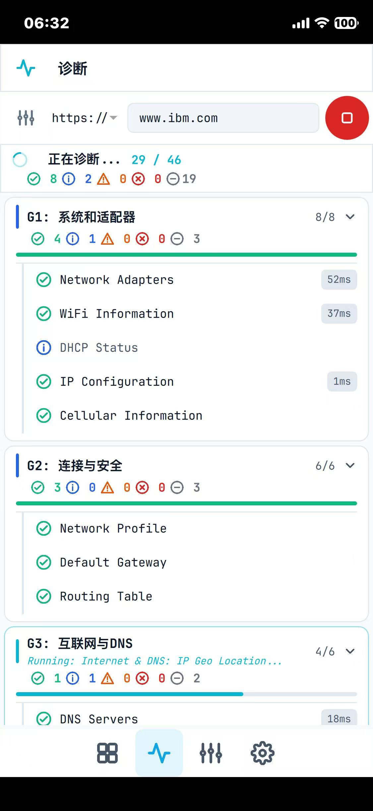
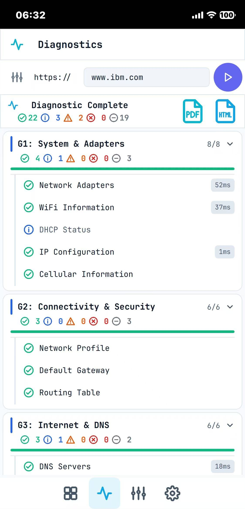
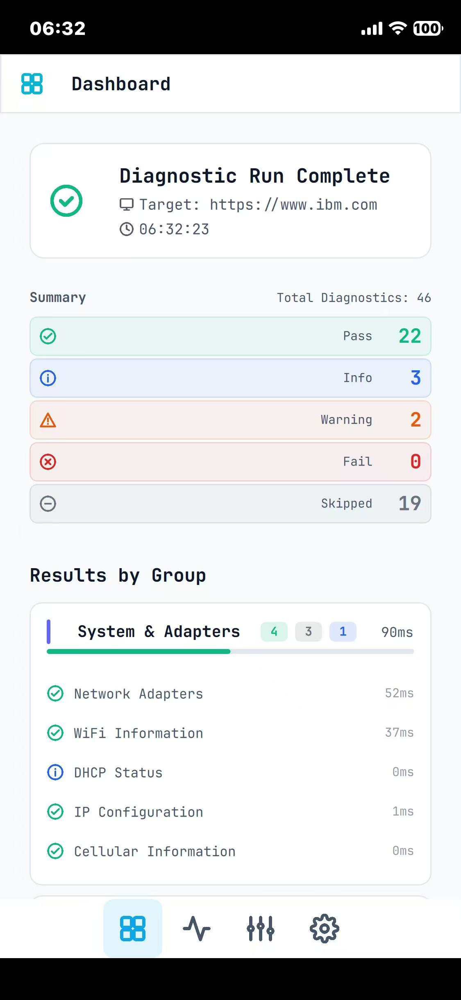
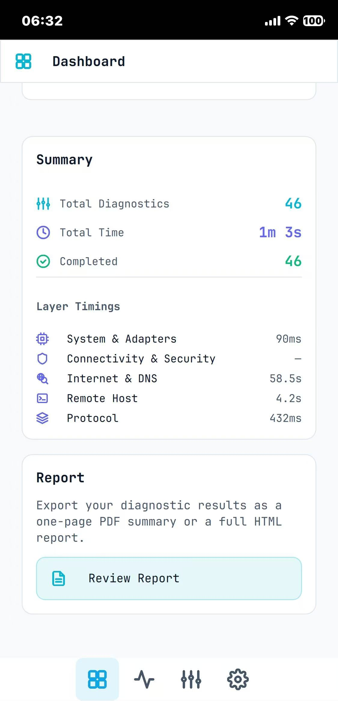
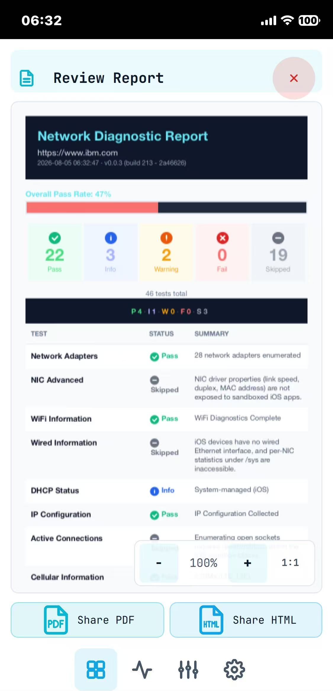
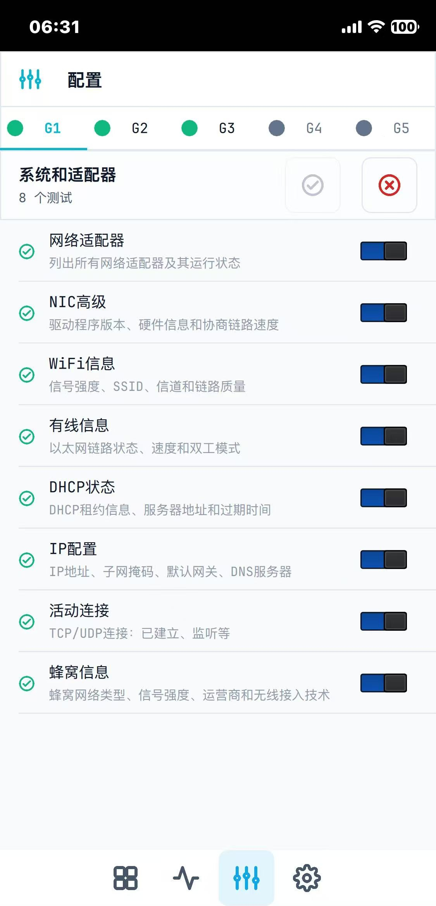
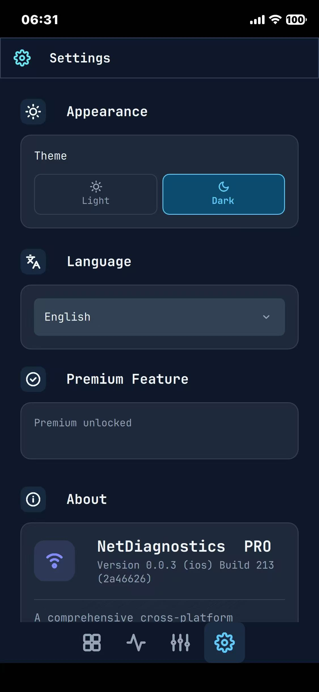

# NetDiagnostics

<p align="center">
  <b>Professional cross-platform network diagnostic toolkit</b><br/>
  Built with Qt 6 / QML and libcurl<br/>
  <sub>iOS &middot; Android &middot; Windows &middot; macOS &middot; Linux</sub>
</p>

[English](README.md) | [简体中文](README_zh_CN.md) | [繁體中文](README_zh_TW.md)

## Screenshots

Desktop screenshots are real OS-level captures. iOS screenshots are captured
manually from a real device with light &amp; dark theme variants. Android
screenshots are captured from an emulator or physical device.

### Desktop

| Stage | Linux | Windows | macOS |
|---|---|---|---|
| **Dashboard** |  |  |  |
| **Running** |  |  |  |
| **Results** |  |  |  |
| **Detail** |  |  |  |
| **Report** |  |  |  |
| **Config** |  |  |  |
| **Settings** |  |  |  |

### iOS — Real Device Screenshots

<p align="center">
  <sub>Captured on iPhone &nbsp;·&nbsp; Light &amp; Dark theme &nbsp;·&nbsp; Auto-matching via <code>&lt;picture&gt;</code> media queries</sub>
</p>

#### Diagnostic Flow

<table>
<tr>
  <td align="center" width="33%"><b>Idle</b></td>
  <td align="center" width="33%"><b>Running</b></td>
  <td align="center" width="33%"><b>Results</b></td>
</tr>
<tr>
  <td><picture>
    <source media="(prefers-color-scheme: dark)" srcset="resources/doc/screenshot/ios/phone/diagnostics-idle-dark.jpg">
    
  </picture></td>
  <td><picture>
    <source media="(prefers-color-scheme: dark)" srcset="resources/doc/screenshot/ios/phone/diagnostics-running-dark.jpg">
    
  </picture></td>
  <td><picture>
    <source media="(prefers-color-scheme: dark)" srcset="resources/doc/screenshot/ios/phone/diagnostics-complete-dark.jpg">
    
  </picture></td>
</tr>
</table>

#### Dashboard &amp; Report

<table>
<tr>
  <td align="center" width="33%"><b>Dashboard</b></td>
  <td align="center" width="33%"><b>Summary</b></td>
  <td align="center" width="33%"><b>Report</b></td>
</tr>
<tr>
  <td><picture>
    <source media="(prefers-color-scheme: dark)" srcset="resources/doc/screenshot/ios/phone/dashboard-complete-dark.jpg">
    
  </picture></td>
  <td><picture>
    <source media="(prefers-color-scheme: dark)" srcset="resources/doc/screenshot/ios/phone/dashboard-summary-dark.jpg">
    
  </picture></td>
  <td><picture>
    <source media="(prefers-color-scheme: dark)" srcset="resources/doc/screenshot/ios/phone/report-dark.jpg">
    
  </picture></td>
</tr>
</table>

#### Configuration &amp; Settings

<table>
<tr>
  <td align="center" width="50%"><b>Config</b></td>
  <td align="center" width="50%"><b>Settings</b></td>
</tr>
<tr>
  <td><picture>
    <source media="(prefers-color-scheme: dark)" srcset="resources/doc/screenshot/ios/phone/config-dark.jpg">
    
  </picture></td>
  <td><picture>
    <source media="(prefers-color-scheme: dark)" srcset="resources/doc/screenshot/ios/phone/settings-dark.jpg">
    
  </picture></td>
</tr>
</table>

### Android

> Android screenshots are captured from an emulator or physical device.

| Stage | Phone | Tablet |
|---|---|---|
| **Dashboard** |  |  |
| **Running** |  |  |
| **Results** |  |  |
| **Report** |  |  |
| **Config** |  |  |

## Themes

NetDiagnostics includes a custom theme engine with **Dark** and **Light** variants,
toggleable in Settings. Screenshots use `<picture>` media queries to match your
GitHub theme automatically.

<table>
<tr>
  <td align="center" width="50%"><b>Dark</b></td>
  <td align="center" width="50%"><b>Light</b></td>
</tr>
<tr>
  <td></td>
  <td></td>
</tr>
</table>

> **Accent colour:** Cyan (`#22D3EE`) &nbsp;|&nbsp; **Background:** `#0F172A` (dark) / `#FFFFFF` (light) &nbsp;|&nbsp; **Surface cards:** subtle border + rounded corners on both themes.

## Multi-Language

NetDiagnostics features a complete **9-language i18n system** driven by a custom
`Tr.*` QML singleton. Every UI string — navigation labels, diagnostic status
messages, report section headers, group names, and settings descriptions — is
translated at runtime through a single `t()` function that accepts all 9
language variants simultaneously.

The language selector lives in **Settings → Language** as a ComboBox dropdown,
listing languages in alphabetical order. A confirmation toast displays the
selected language name for 3 seconds after switching, preventing disorientation
if the wrong language is tapped.

### Supported Languages

| # | Language | Internal Index | UI Label |
|---|----------|:---:|----------|
| 1 | English | `0` | English |
| 2 | Français | `1` | Français |
| 3 | Deutsch | `2` | Deutsch |
| 4 | Русский | `3` | Русский |
| 5 | Italiano | `4` | Italiano |
| 6 | 简体中文 | `5` | 简体中文 |
| 7 | 繁體中文 | `6` | 繁體中文 |
| 8 | Español | `7` | Español |
| 9 | Português | `8` | Português |

### Language Selector

<table>
<tr>
  <td align="center"><b>Settings — Language dropdown</b><br/><sub>The ComboBox lists all 9 languages alphabetically; switching triggers a toast.</sub></td>
</tr>
<tr>
  <td><picture>
    <source media="(prefers-color-scheme: dark)" srcset="resources/doc/screenshot/ios/phone/settings-dark.jpg">
    
  </picture></td>
</tr>
</table>

### i18n Architecture

```
QML: Tr.dashboard  →  Translations.qml (pragma Singleton)
                    →  t("Dashboard", "Tableau de bord", "Dashboard", ...)
                    →  lang index from appState.languageIndex (C++)
                    →  Instant, zero-latency UI re-render
```

> **Key design decisions:**
> - **Single-source `t()` function** — all 9 translations for a string live on
>   one line; adding a language means adding one parameter position across the
>   codebase.
> - **Alphabetical ordering** — the ComboBox model is sorted by display name so
>   users find their language predictably, regardless of internal index.
> - **Persistence** — `appState.setLanguage(idx)` writes to QSettings; the
>   selection survives app restarts.
> - **Toast feedback** — prevents the "trapped in wrong language" UX failure:
>   if the user mis-taps, the toast shows the selected language name and they
>   can immediately switch back.

## Features

### Diagnostic Engine — 46 tests in 5 groups

| Group | Tests | Description |
|-------|-------|-------------|
| **G1** — System &amp; Adapters | 8 | Network Adapters, NIC Advanced, WiFi Information, Wired Information, DHCP Status, IP Configuration, Active Connections, Cellular Information |
| **G2** — Connectivity &amp; Security | 6 | Network Profile, TCP Settings, Default Gateway, Routing Table, ARP Table, Proxy Settings |
| **G3** — Internet &amp; DNS | 6 | Netskope Status, DNS Servers, DNS Cache, DNS Integrity, IP Geolocation, Internet Connectivity &amp; Speed |
| **G4** — Remote Host | 6 | DNS Resolution, Ping, IPv6 Connectivity, Traceroute, PathPing, MTU Discovery |
| **G5** — Protocol | 20 | URL Parsing, TCP Connect, Service Banner, HTTP Request, HTTP Headers, Security Headers, SSL Certificate, HTTP Redirect, HTTP Compression, HTTP Timing, FTP, SSH, Email, Telnet, MySQL, PostgreSQL, Redis, MongoDB, LDAP, MQTT |

### Key Capabilities

- **Cross-platform** — single C++/QML codebase targeting iOS, Android, Windows, macOS, Linux
- **Real-time diagnostics** — results stream live as each test completes, with progress indicators and status badges
- **Dark &amp; Light themes** — custom theme engine with cyan accent palette, toggled in Settings
- **9-language UI** — English, Français, Deutsch, Русский, Italiano, 简体中文, 繁體中文, Español, Português
- **Report export** — PDF and HTML reports with summary cards, per-group breakdowns, and detailed diagnostic output
- **Group configuration** — enable/disable individual tests or entire groups per diagnostic run
- **G5 protocol suite** — raw TCP socket diagnostics for MySQL, PostgreSQL, Redis, MongoDB, LDAP, MQTT plus banner detection for FTP, SSH, SMTP/IMAP/POP3, Telnet
- **DNS diagnostics** — dig-style output with resolver cache inspection, server responsiveness, and integrity checks
- **Target Analysis** — URL component breakdown, IP classification (RFC 1918 / CGNAT / APIPA / Loopback / Public), known port reference table
- **Premium IAP** — non-consumable unlock for report sharing via OS share sheet and email

## Supported Platforms

| Platform | Architectures |
|----------|--------------|
| iOS | arm64 |
| Android | arm64, x86_64 |
| Windows | x86_64 (static and dynamic) |
| macOS | arm64 |
| Linux | x86_64, arm64 |

## Technology Stack

| Layer | Technology |
|-------|-----------|
| Framework | Qt 6 (C++17) — Core, Concurrent, Quick, QuickControls2, Network, Widgets |
| UI | QML with custom ThemeEngine, 9-language i18n via `Tr.*` singleton |
| HTTP/HTTPS | libcurl (desktop), NSURLSession (iOS), HttpURLConnection (Android) |
| TCP / SSL | QTcpSocket, QSslSocket with X.509 chain inspection |
| Platform APIs | WLAN API + IP Helper (Windows), NetworkExtension + CoreTelephony (iOS), ConnectivityManager + WifiManager via JNI (Android), SystemConfiguration + CoreWLAN (macOS) |
| Build | CMake 3.22+, Ninja, GitHub Actions CI |
| Fonts | JetBrains Mono (UI), DejaVu Sans Mono (box-drawing for terminal output) |

## License

MIT
