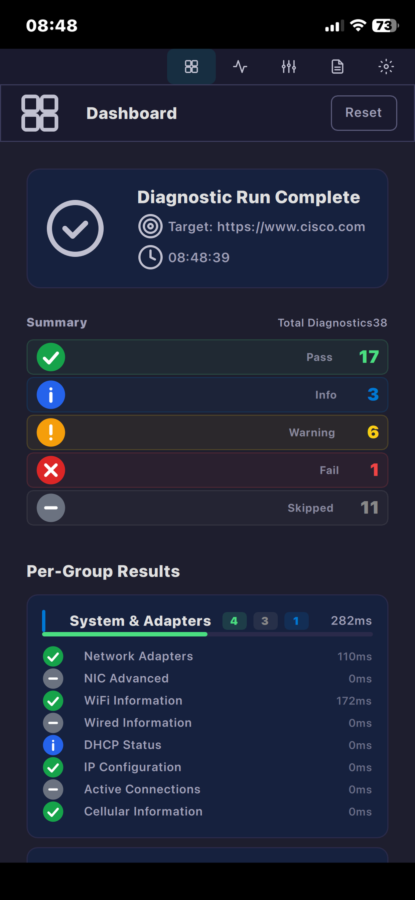
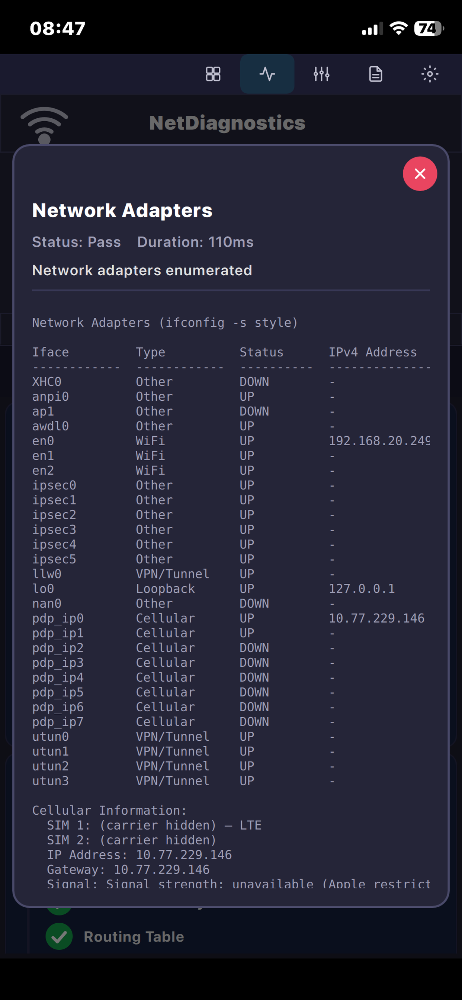
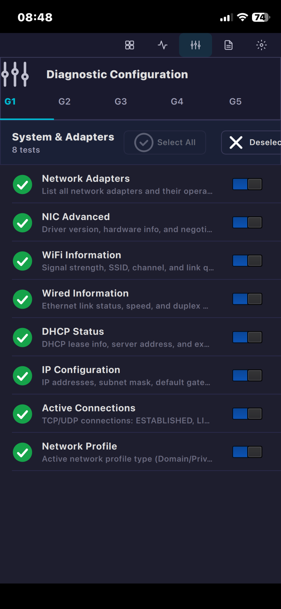
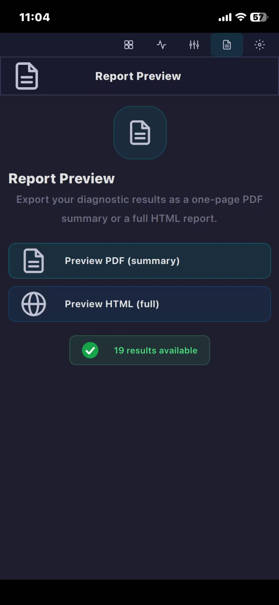
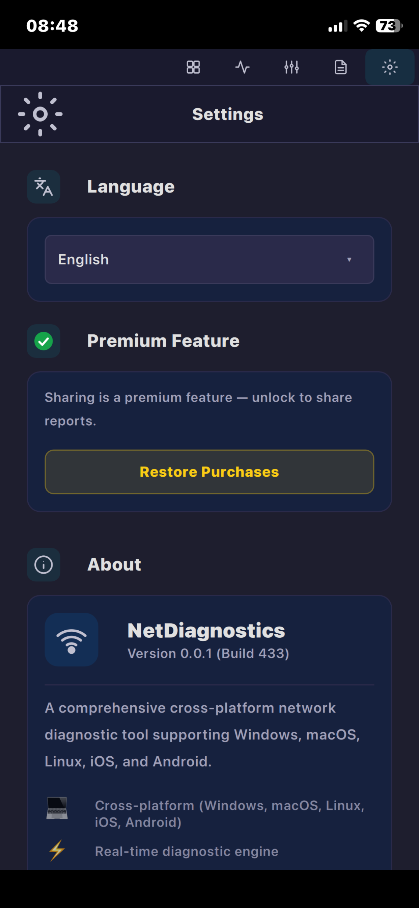

# NetDiagnostics

<p align="center">
  <b>專業跨平台網路診斷工具</b><br/>
  基於 Qt 6 / QML 和 libcurl 構建<br/>
  <sub>iOS &middot; Android &middot; Windows &middot; macOS &middot; Linux</sub>
</p>

[English](README.md) | [简体中文](README_zh_CN.md) | [繁體中文](README_zh_TW.md)

## 螢幕截圖

<p align="center">
  
  
  
  
  
</p>

## 功能特性

### 診斷引擎（5 組 45 項測試）

| 組 | 測試數 | 說明 |
|-------|-------|-------------|
| **G1** — 系統與適配器 | 8 | 網路適配器、NIC 進階資訊、WiFi 資訊、有線網資訊、DHCP 狀態、IP 配置、活動連線、蜂巢網路資訊 |
| **G2** — 連線與安全 | 6 | 網路設定檔、TCP 設定、預設閘道、路由表、ARP 表、代理設定 |
| **G3** — 網際網路與 DNS | 5 | Netskope 狀態、DNS 伺服器、DNS 快取、DNS 污染、網際網路速度測試 |
| **G4** — 遠端主機 | 6 | DNS 解析、Ping、路由追蹤、路徑 Ping、MTU 發現、連接埠掃描 |
| **G5** — 網站 / URL | 20 | URL 解析、TCP 連線、服務橫幅、cURL 詳細輸出、HTTP 標頭、安全標頭、SSL 憑證、HTTP 重新導向、HTTP 壓縮、HTTP 計時、FTP、SSH、Email、Telnet、MySQL、PostgreSQL、Redis、MongoDB、LDAP、MQTT |

### 主要特性

- **跨平台** — 單一程式碼庫涵蓋 iOS、Android、Windows、macOS、Linux
- **純 C++ 診斷** — 零 Shell 指令，直接呼叫作業系統 API
- **即時引擎** — 每項測試完成後即時推送結果
- **報告匯出** — PDF（儀表板風格摘要）和 HTML（暗色主題完整詳情），含進度條、狀態指示器和主題配色
- **設定持久化** — 語言、作用中群組和逐項測試啟用狀態在應用程式重啟後自動恢復（QSettings）
- **進階內購** — 非消耗型解鎖，可使用系統分享/郵件分享報告
- **9 語言介面** — English、Français、Deutsch、Русский、Italiano、简体中文、繁體中文、Español、Português
- **暗色主題** — 自訂暗色介面，青色 (`#22D3EE`) 強調色調；報告樣式與應用程式主題一致
- **G5 協定診斷** — 20 項按協定分類的測試，包括 MySQL、PostgreSQL、Redis、MongoDB、LDAP、MQTT（基於原始 TCP 通訊端）
- **DNS 診斷** — dig 風格輸出，包含 HEADER/QUESTION/ANSWER 段落、DNSSEC 驗證、DNS 污染偵測
- **速度測試** — 相容 Ookla 的下載/上傳頻寬測量
- **分組順序執行** — `std::thread` 併發，`std::atomic` 分組追蹤
- **啟動崩潰診斷** — `ND_DEBUG=ON` 將帶時間戳的啟動事件寫入 `%TEMP%\NetDiagnostics_startup.log`
- **單執行個體鎖** — 防止重複啟動應用程式執行個體

## 支援平台

| 平台 | 架構 | 說明 |
|----------|------|------|
| iOS | arm64 | StoreKit 內購、系統分享、WiFi SSID、原生 HTTP/DNS |
| Android | arm64 / x86_64 | 透過 FileProvider 分享、JNI 原生診斷 |
| Windows | x86_64 | 靜態（零 DLL）和動態建置，基於 MSYS2 UCRT64 |
| macOS | arm64 | 通用二進位檔，原生 Homebrew Qt 6 |
| Linux | x86_64 / arm64 | AppImage + deb + rpm 套件 |

## 技術堆疊

**核心框架：** Qt 6 (C++17) — Core、Concurrent、Quick、QuickControls2、Widgets、Network

**UI 層：** QML + 自訂暗色主題引擎，透過 Qt Linguist 實現 9 語言國際化

**網路庫：**
- **libcurl** — 桌面端 HTTP/HTTPS 診斷（傳輸、標頭資訊、計時、壓縮）
- **QSslSocket** — SSL/TLS 憑證檢查，完整 X.509 鏈提取
- **QTcpSocket** — 原始 TCP 連線、服務橫幅和 7 種協定診斷
- **原生通訊端 API** — `winsock2`（Windows）、POSIX 通訊端（Linux/macOS）、Network framework（iOS）

**平台 SDK：**
- **iOS** — NetworkExtension、CoreLocation、CoreTelephony、StoreKit、CFNetwork、NSURLSession
- **Android** — JNI 封裝（ConnectivityManager、WifiManager、TelephonyManager、`HttpURLConnection`）
- **Windows** — WLAN API、IP Helper API、WinHTTP、WinSock2
- **macOS** — SystemConfiguration、CoreWLAN、IOKit

**建置系統：** CMake 3.22+，Ninja 產生器；透過 GitHub Actions 實現 CI/CD（build.yml + apple.yml）

**字型：** JetBrains Mono（UI）、DejaVu Sans Mono（樹狀診斷的製表符字形）

## 建置

### 快速開始（自動化）

```bash
# 原生建置（自動偵測宿主平台）
./scripts/build-all.sh

# 交叉編譯指定目標
./scripts/build-all.sh --target windows-x86_64

# 自動修復所有缺失依賴
./scripts/build-all.sh --fix --target all
```

### 手動建置

#### Linux / macOS

```bash
# 依賴
sudo apt install qt6-base-dev qt6-quickcontrols2-dev libcurl4-openssl-dev cmake ninja-build  # Linux
brew install qt@6 cmake ninja curl                                                             # macOS

# 建置
cmake -G Ninja -DCMAKE_BUILD_TYPE=Release -B build -S .
ninja -C build net_diagnostics
```

#### iOS

```bash
cmake -G Xcode \
  -DCMAKE_TOOLCHAIN_FILE=/path/to/qt6/ios.toolchain.cmake \
  -B build/ios
# 在 Xcode 中開啟 build/ios/*.xcodeproj → 選擇裝置 → Build
```

#### Android

```bash
cmake -G Ninja \
  -DCMAKE_TOOLCHAIN_FILE=/path/to/qt6/android.toolchain.cmake \
  -DANDROID_ABI=arm64-v8a \
  -B build/android
ninja -C build/android net_diagnostics
```

### 除錯建置（啟動崩潰診斷）

```bash
cmake -G Ninja -DCMAKE_BUILD_TYPE=Release -DND_DEBUG=ON -B build -S .
ninja -C build net_diagnostics
# 執行應用程式 → 檢視 %TEMP%\NetDiagnostics_startup.log 中的啟動事件
```

### 無頭測試

```bash
ND_MAX_TESTS=2 ND_AUTORUN=1 QT_QPA_PLATFORM=offscreen ./build/net_diagnostics
```

### Windows 靜態建置 (MSYS2 UCRT64)

```bash
# 需要安裝 MSYS2 和 mingw-w64-ucrt-x86_64-qt6-static
cmake -G Ninja -DCMAKE_PREFIX_PATH=/ucrt64/qt6-static \
      -DCMAKE_BUILD_TYPE=Release -DBUILD_TESTS=OFF -B build -S .
ninja -C build net_diagnostics
# 驗證零非系統 DLL：
objdump -p build/net_diagnostics.exe | grep "DLL Name"
```

## CI/CD

每次推送透過 GitHub Actions 自動建置。

| 工作流程 | 平台 |
|----------|-----------|
| **build.yml** | Linux (x86_64 + arm64)、Windows (x86_64 靜態 + 動態)、macOS (arm64)、Android (arm64 + x86_64) |
| **apple.yml** | macOS (arm64 應用程式套件)、iOS (arm64 → TestFlight) |

## 應用程式內購買

**非消耗型進階版**內購（產品 ID：`com.netdiagnostic.app.premium`）可解鎖報告分享功能（透過系統分享選單或郵件）。基於 iOS StoreKit 建置，透過 `QSettings` 持久化儲存，支援離線解鎖。透過 App Store Connect 沙盒測試帳號進行測試。

## 依賴

| 依賴 | 版本 | 用途 |
|------------|---------|---------|
| Qt 6 | ≥ 6.2 | Core、Concurrent、Quick、QuickControls2、Network |
| libcurl | ≥ 7.80 | HTTP/HTTPS 診斷（桌面端；iOS 使用 NSURLSession） |
| CMake | ≥ 3.22 | 建置系統 |

## 授權條款

MIT
