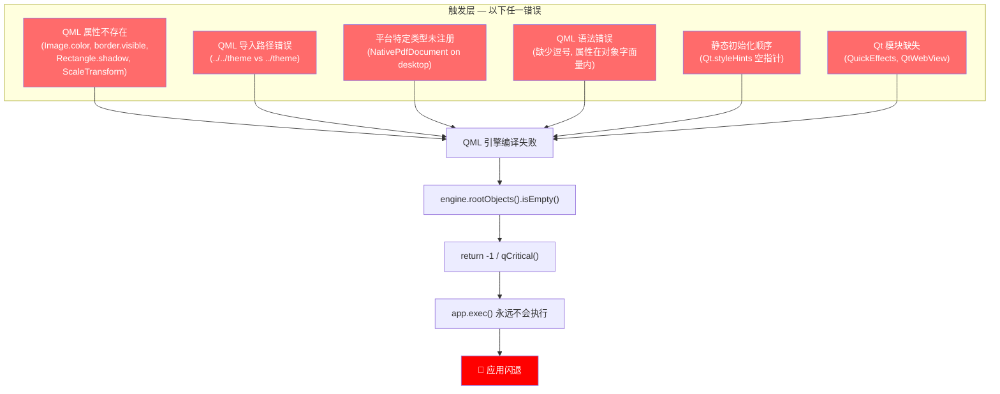

# iOS 启动闪退 5WHY 根因分析与代码检查清单

> **从 GitHub 提交历史中所有 iOS/启动闪退修复中提炼的系统性分析**
> 覆盖 30+ 个修复提交，横跨 QML / C++ / CMake / QRC / Qt 静态构建领域
> 最后更新：2026-08-05

---

## 目录

1. [核心发现：统一的崩溃链模型](#1-核心发现统一的崩溃链模型)
2. [Category A：QML 属性/类型错误 — 11 次修复](#category-a-qml-属性类型错误)
3. [Category B：QML 导入路径与语法错误 — 5 次修复](#category-b-qml-导入路径与语法错误)
4. [Category C：平台隔离 QRC 条件编译 — 4 次修复](#category-c-平台隔离-qrc-条件编译)
5. [Category D：静态 Qt 初始化顺序 — 3 次修复](#category-d-静态-qt-初始化顺序)
6. [Category E：QObject 生命周期与信号处理器安全 — 3 次修复](#category-e-qobject-生命周期与信号处理器安全)
7. [Category F：缺失模块/静默失败 — 2 次修复](#category-f-缺失模块静默失败)
8. [Category G：CMake 平台条件构建 — 2 次修复](#category-g-cmake-平台条件构建)
9. [Category H：文本污染与编码破坏 — 1 次修复](#category-h-文本污染与编码破坏)
10. [Category I：QtObject 无 default property — 1 次修复](#category-i-qtobject-无-default-property)
11. [Category J：QML 文件结构性损坏 — 构建时验证缺失（2026-08-05 最新）](#category-jqml-文件结构性损坏--构建时验证缺失)
12. [提交前自检清单（完整版）](#10-提交前自检清单完整版)
13. [附录：全部相关提交索引](#11-附录全部相关提交索引)

---

## 1. 核心发现：统一的崩溃链模型

所有 iOS 启动闪退共享**同一条致命链路**：

```
单个 QML/C++ 错误
  → QML engine 编译/加载失败
    → engine.rootObjects().isEmpty() == true
      → return -1（在 app.exec() 之前）
        → 应用瞬间退出（闪退）
```

### 1.1 完整 5WHY 终极根因

| Why | 回答 |
|-----|------|
| **Why 1:** 应用为什么闪退？ | `engine.rootObjects().isEmpty()` → `return -1` 在 `app.exec()` 之前退出 |
| **Why 2:** 为什么 rootObjects 为空？ | `engine.load(main.qml)` 失败 — QML 引擎编译期报致命错误 |
| **Why 3:** 为什么 QML 编译失败？ | 任何被 **eagerly compiled**（急切编译）的 QML 组件包含 iOS 平台不可用的属性/类型/模块 |
| **Why 4:** 为什么这些错误只出现在 iOS？ | iOS 使用 **静态 Qt 构建**：QML 插件链接到单一二进制、某些 Qt 模块（QuickEffects/WebView）缺失、QML 属性集合与桌面动态构建不同、C++ 全局对象初始化顺序不可控 |
| **Why 5:** 为什么没有提前发现？ | **QML 急切编译机制**：`Component { Type {...} }` 内联组件在父文档编译时解析所有 import 和属性绑定，即使 `active: false` 也会触发错误。与 Loader `source: "qrc:/..."` 的延迟编译行为完全不同。桌面动态 Qt 的宽松模式掩盖了这些错误。 |

### 1.2 关键概念：QML 急切编译 (Eager Compilation)

```
// ❌ 危险 — 内联 Component 在父文档编译时即解析所有依赖
Component {
    SomeScreen {
        // 所有 import、属性绑定、子类型 在此刻编译
        // 即使 Component 从未被实例化
    }
}

// ✅ 安全 — Loader + source URL 延迟编译到 active=true
Loader {
    active: false
    source: "qrc:/qml/screens/SomeScreen.qml"
    // 只有 active 变为 true 时才编译此文件
}
```

### 1.3 崩溃链可视化



---

## Category A：QML 属性/类型错误

> **频率最高：11 次修复**。任何不存在的属性都会导致 QML 类型创建失败。

### A.1 Image.color 属性不存在于 iOS 静态构建

- **提交**: `8f2fee9` — `fix: iOS startup crash — Image.color property binding removed from AppIcon`

**5WHY 分析**:

| Why | 回答 |
|-----|------|
| 1. 应用为什么退出？ | QML engine 返回 0 root objects |
| 2. 为什么没有 root objects？ | Type AppContent 不可用 |
| 3. 为什么 AppContent 不可用？ | Type DiagnosticScreen 不可用 |
| 4. 为什么 DiagnosticScreen 不可用？ | Type AppBar 不可用 |
| 5. 为什么 AppBar 不可用？ | Type AppIcon 不可用 — **`Image.color` 属性在 iOS 静态 Qt 6.8.3 构建中不存在** |

**根因**: `Image.color`（Qt 6.5+ 原生 SVG 着色属性）在 iOS 静态构建中被裁剪。静态属性绑定到不存在的属性 → QML 类型创建失败 → 级联崩溃。

**规则**: **禁止假设桌面 Qt 的属性集在 iOS/静态构建中存在。始终用 `Component.onCompleted` 做运行时能力检测。**

```qml
// ❌ 错误 — 静态属性绑定到可能不存在的属性
Image {
    source: "icon.svg"
    color: ThemeEngine.accentColor  // iOS 静态构建可能崩溃
}

// ✅ 正确 — 运行时能力检测 + 降级方案
Image {
    id: iconImg
    source: "icon.svg"
    Component.onCompleted: {
        // 尝试 JS 赋值检测属性是否存在
        iconImg.color = ThemeEngine.accentColor
        if (iconImg.color.toString() === "undefined") {
            // 降级：使用 Rectangle overlay
            colorOverlay.visible = true
        }
    }
}
```

### A.2 Rectangle.shadow 属性不存在

- **提交**: `ffa6760` — `Fix iOS launch crash: remove invalid Rectangle.shadow property`

**5WHY 分析**:

| Why | 回答 |
|-----|------|
| 1. 为什么闪退？ | engine.load(main.qml) 失败 |
| 2. 为什么 main.qml 加载失败？ | AppContent 编译失败 |
| 3. 为什么 AppContent 编译失败？ | ReportScreen 类型引用失败 |
| 4. 为什么 ReportScreen 失败？ | 它编译了一个 `Component { ReportScreen { ... } }` |
| 5. 为什么 ReportScreen 编译失败？ | `Rectangle { shadow.color: ...; shadow.radius: ...; shadow.yOffset: ... }` — **Qt Quick Rectangle 类型没有 `shadow` 属性** |

**规则**: **Rectangle 没有 `shadow` 属性。阴影效果必须通过独立组件（如 `DropShadow`）或多层叠加实现。**

```qml
// ❌ 错误 — Rectangle 没有 shadow 属性
Rectangle {
    radius: 12; color: "#1F1F32"
    shadow.color: "#00000040"; shadow.radius: 12; shadow.yOffset: 4
}

// ✅ 正确 — 使用多层叠加模拟阴影
Item {
    // 阴影层
    Rectangle {
        anchors.fill: parent; anchors.margins: -4
        radius: 16; color: "#40000000"
        layer.enabled: true
    }
    // 内容层
    Rectangle {
        anchors.fill: parent
        radius: 12; color: "#1F1F32"
    }
}
```

### A.3 border.visible 属性不存在

- **提交**: `87e8d73` — `fix(ios): remove non-existent border.visible property causing QML fatal on startup`

**5WHY 分析**:

| Why | 回答 |
|-----|------|
| 1. 为什么 iOS 崩溃？ | QML engine 加载失败 |
| 2. 为什么加载失败？ | ShareSubscriptionDialog 类型编译失败 |
| 3. 为什么编译失败？ | `border.visible: false` 属性赋值失败 |
| 4. 为什么属性不存在？ | Qt Quick `Border` 类型只有 `width` 和 `color` 属性，没有 `visible` |
| 5. 为什么之前没发现？ | 桌面动态 Qt 对此类错误的容忍度更高，但 iOS 静态构建严格编译所有属性 |

**规则**: **Qt Quick Border 类型属性清单：`border.width`、`border.color`。没有 `border.visible`。用 `border.width: 0` 替代隐藏。**

### A.4 ScaleTransform 不是有效 QML 类型

- **提交**: `718b676` — `@ fix(ios): resolve QML startup crash — 5WHY root cause + 3 collateral fixes`

**5WHY 分析**:

| Why | 回答 |
|-----|------|
| 1. 为什么崩溃？ | engine.load() 失败 |
| 2. 为什么加载失败？ | ReportScreen → AppContent → main.qml 级联失败 |
| 3. 为什么 ReportScreen 失败？ | 包含 `ScaleTransform {}` 的 Flickable 编译失败 |
| 4. 为什么 ScaleTransform 无效？ | Qt 6.8.3 中正确的类型名是 `Scale`（QtQuick），不是 `ScaleTransform` |
| 5. 为什么平台差异？ | `ScaleTransform` 是 Qt GraphicalEffects 的类型（已弃用），iOS 静态构建不包含该模块 |

**规则**: **使用 `Scale`（QtQuick）而非 `ScaleTransform`（已弃用）。`PinchHandler.scale` 是累计手势因子（非增量），直接赋值而非乘法叠加。**

### A.5 compact:true 绑定不存在

- **提交**: `ebd3cf3` — `fix(ios): remove stale compact:true binding causing QML startup crash`

**规则**: **删除 `compact:true` 残留绑定。该属性不是标准 Qt Quick 属性，iOS 严格模式下导致编译失败。**

### A.6 禁止的属性/类型汇总

| 错误用法 | 正确替代 | 提交 |
|----------|----------|------|
| `Image.color` (静态属性绑定) | `Component.onCompleted` 运行时检测 + Rectangle overlay | `8f2fee9` |
| `Rectangle.shadow.*` | 多层 Item/Rectangle 叠加 + `layer.enabled` | `ffa6760` |
| `border.visible` | `border.width: 0` 或条件 `border.width` | `87e8d73` |
| `ScaleTransform {}` | `Scale {}` (QtQuick) | `718b676` |
| `compact: true` | 删除（非标准属性） | `ebd3cf3` |
| `font.family: "A, B, C"` (CSS fallback) | 单一字体名 `font.family: "A"` | `ffa6760` |
| `Qt.styleHints.colorScheme` (静态绑定) | 延迟初始化/手动设置 | `13090e6` |

---

## Category B：QML 导入路径与语法错误

> **5 次修复**。相对路径错误和 QML 语法错误导致级联类型解析失败。

### B.1 错误的相对导入路径（2 次同样问题）

- **提交**: `bc42bf0` — `fix(crash): iOS startup crash — wrong relative import path in ShareSubscriptionDialog`
- **提交**: `d9fe11a` — `fix(crash): iOS startup crash — wrong import path + remove dead SettingsScreen import`

**5WHY 分析**:

| Why | 回答 |
|-----|------|
| 1. iOS 为什么崩溃？ | engine.load() 返回 0 root objects |
| 2. 为什么？ | main.qml → AppContent → DiagnosticScreen → ShareSubscriptionDialog 级联失败 |
| 3. 为什么 ShareSubscriptionDialog 失败？ | 无法解析 `T.ThemeEngine` — import 路径错误 |
| 4. 为什么路径错误？ | `import '../../theme'` 解析为 `qrc:/theme/`（不存在）。文件在 `qrc:/qml/dialogs/`，需要 `import '../theme'` → `qrc:/qml/theme/` |
| 5. 为什么只有一个文件出错？ | 其他 27 个 QML 文件都正确使用了 `'../theme'`（一层），只有这个文件用了 `'../../theme'`（两层），多了一层目录 |

**规则**: **QRC 中的相对导入路径：从当前文件的 QRC 路径算层级。本项目中，标准模式是 `import '../theme'`、`import '../widgets'`（一层 `../`）。禁止 `../../` 跨两层。**

```qml
// 文件位置: qrc:/qml/dialogs/ShareSubscriptionDialog.qml
// ❌ 错误 — ../../theme → qrc:/theme/（不存在！）
import "../../theme" as T

// ✅ 正确 — ../theme → qrc:/qml/theme/
import "../theme" as T
```

### B.2 QML 属性声明在对象字面量内部

- **提交**: `f36c07e` — `fix: iOS crash — VPN i18n props misplaced inside diagDesc object literal`

**5WHY 分析**:

| Why | 回答 |
|-----|------|
| 1. 为什么 iOS 崩溃？ | QML 引擎报 `Expected token ","` |
| 2. 为什么语法错误？ | 5 条 `readonly property string xxx` 声明被放在了 `function diagDesc()` 的 `var items = {...}` 对象字面量内部 |
| 3. 为什么这会导致问题？ | QML 对象字面量内不能包含 `readonly` 关键字属性声明 |
| 4. 为什么没被发现？ | 它们被插入在 entry 19 之后，混合在普通的 key: value 条目中间 |
| 5. 根本原因？ | 插入位置错误 — readonly property 必须在 QML 根级别声明，不能在函数体内的对象字面量中 |

**规则**: **`readonly property` 声明只能在 QML 根级别。函数体内的 `var obj = { ... }` 是 JavaScript 对象字面量，不支持 QML 关键字。**

```qml
// ❌ 错误 — readonly property 在对象字面量内
function foo() {
    var items = {
        1: "value 1",
        readonly property string x: "bad"  // QML 解析器崩溃
    }
}

// ✅ 正确 — readonly property 在根级别
Item {
    function foo() {
        var items = { 1: "value 1" }
    }
    readonly property string x: "good"
}
```

### B.3 缺少逗号导致语法错误

- **提交**: `8b577ec` — `fix(ios): add missing comma in Translations.qml diagDesc, fix QML startup crash`

**规则**: **QML JavaScript 对象字面量中的每个 entry 后必须有逗号。`{ 1: "a" 2: "b" }` 是语法错误。**

### B.4 QML 语法检查清单

| 检查项 | grep/检测方法 |
|--------|---------------|
| 相对 import 路径是否正确？ | 手动检查每个 `import "..` 的层级数 vs 文件在 QRC 中的路径 |
| `readonly property` 是否在根级别？ | `grep -rn "readonly property" | grep -v "^\s*readonly"` 找缩进异常 |
| 对象字面量是否缺少逗号？ | 人工审查 `{ ... }` 块中的属性分隔 |
| 是否残留死 import？ | `grep -rn "^import" | grep -v "QtQuick\|QtQuick.Controls\|QtQuick.Layouts"` 找异常 |

---

## Category C：平台隔离 QRC 条件编译

> **4 次修复**。平台特定类型/模块的 QML 文件必须隔离到条件 QRC 中。

### C.1 NativePdfPageView.qml 导致桌面崩溃

- **提交**: `400cdde` — `fix(crash): isolate NativePdfPageView.qml in mobile-only conditional QRC (5WHY)`

**5WHY 分析**:

| Why | 回答 |
|-----|------|
| 1. 桌面为什么闪退？ | engine.load(main.qml) 失败 → rootObjects 为空 → return -1 |
| 2. 为什么 QML 加载失败？ | QML 引擎编译 NativePdfPageView.qml 失败 |
| 3. 为什么会编译这个文件？ | `AppContent.qml` 有内联 `Component { ReportScreen {...} }` → 急切编译 ReportScreen → `import '../widgets'` → 注册 widgets/ 目录下**所有** .qml 文件 |
| 4. 为什么 NativePdfPageView.qml 编译失败？ | 它访问 `NetDiagnostics 1.0` 模块的 `NativePdfDocument` 类型，该类型仅在 iOS/Android 通过 `qmlRegisterType` 注册 |
| 5. 为什么它被包含在桌面构建中？ | 它在主 `resources.qrc` 中（无条件包含） |

**根因**: **任何引用平台特定 C++ 类型（qmlRegisterType）的 QML 文件必须隔离到条件 QRC 中。`import '../widgets'` 会触发该目录下所有 .qml 文件的类型注册，即使没有被实例化。**

**修复模式**:
```cmake
# CMakeLists.txt
if(IOS OR ANDROID)
    qt_add_resources(app qml "resources/resources_nativepdf.qrc")
endif()
```

### C.2 HtmlPreviewWebView.qml 被误删出 QRC

- **提交**: `ffa2e29` — `fix(ios): re-add HtmlPreviewWebView.qml to QRC for Loader source resolution (5WHY)`

**5WHY 分析**:

| Why | 回答 |
|-----|------|
| 1. iOS 为什么预览空白？ | `Loader { source: 'qrc:/qml/widgets/HtmlPreviewWebView.qml' }` 无法在运行时解析 |
| 2. 为什么文件找不到？ | `HtmlPreviewWebView.qml` 被从 `resources.qrc` 中移除了 |
| 3. 为什么被移除？ | 为修复 MSYS2 静态构建崩溃（qmlimportscanner 发现 `import QtWebView` 并要求链接该插件） |
| 4. 为什么移除是错误的？ | 运行时守卫 `active: hasWebView` 已经防止在不支持的平台上加载。移除 QRC 额外破坏了 qrc:/ URL 解析 |
| 5. 根本原因？ | 选择了"全局删除 QRC 条目"而非"条件 QRC 包含"作为修复手段 |

**规则**: **Loader 的 `source: "qrc:/..."` 要求文件存在于 QRC 中。用条件 QRC 包含替代全局删除。运行时 `active` 守卫处理平台可用性。**

### C.3 QtWebView 内联 Component 急切编译导致静态构建崩溃

- **提交**: `d220a44` — `fix(crash): resolve startup crash from eager QML import of QtWebView (5WHY)`

**5WHY 分析**:

| Why | 回答 |
|-----|------|
| 1. 为什么 MSYS2 静态构建闪退？ | engine.load() 失败 |
| 2. 为什么失败？ | ReportScreen.qml 包含内联 `Component { HtmlPreviewWebView {...} }` |
| 3. 为什么内联 Component 会导致问题？ | QML 引擎在父文档编译时急切编译内联 Component 的 import — `HtmlPreviewWebView.qml` 包含 `import QtWebView` |
| 4. 为什么 QtWebView 不存在？ | MSYS2 静态构建不包含 QtWebView 模块 |
| 5. 根本区别是什么？ | **内联 `Component { Type {...} }`：延迟实例化但 NOT 延迟编译 → import 急切解析。`Loader { source: "qrc:/..." }`：延迟编译 AND 延迟实例化 → import 在 active=true 时才解析。** |

**规则**: **使用 `Loader { source: "qrc:/..." }` 替代 `Component { Type {...} }` + `sourceComponent` 来引用含平台特定 import 的 QML 文件。**

### C.4 平台 QRC 隔离清单

| QRC 文件 | 条件 | 包含内容 | 原因 |
|----------|------|----------|------|
| `resources.qrc` | 始终 | 所有平台通用的 QML | 主 QRC |
| `resources_nativepdf.qrc` | `IOS OR ANDROID` | NativePdfPageView.qml | NativePdfDocument 仅在移动端注册 |
| `resources_webview.qrc` | `HAS_WEBVIEW` | HtmlPreviewWebView.qml | QtWebView 模块非所有平台 |
| `resources_qtpdf.qrc` | `HAS_QTPDF` | PdfPreviewView.qml | QtQuick.Pdf 模块非所有平台 |

---

## Category D：静态 Qt 初始化顺序

> **3 次修复**。静态构建中 C++ 全局对象和 QML 绑定初始化顺序不可控。

### D.1 Qt.styleHints 静态绑定导致空指针

- **提交**: `13090e6` — `@ fix(ui): remove Qt.styleHints binding — crashes on Windows static + iOS`

**5WHY 分析**:

| Why | 回答 |
|-----|------|
| 1. 为什么静态构建立即崩溃？ | QML 单例 ThemeEngine 属性绑定失败 — `Qt.styleHints.colorScheme` 访问触发空对象解引用 |
| 2. 为什么 Qt.styleHints 为空？ | QML 绑定引擎在 C++ 后端 `QStyleHints*` 指针初始化完成**之前**评估单例属性绑定 |
| 3. 为什么只影响静态构建？ | 动态构建通过共享库加载，初始化顺序由动态链接器保证 QGuiApplication → QML engine → 单例。静态构建把所有东西链接到一个二进制，链接器可能重排初始化顺序 |
| 4. 为什么 Qt.styleHints 是特殊的？ | 它是少数由 C++ 后端支持的 QML 全局对象之一（`QStyleHints*`），受静态初始化顺序影响 |
| 5. 根本原因？ | **QML 单例属性绑定在模块导入时急切评估，此时 C++ 运行时不保证所有 Qt 全局对象已初始化** |

**规则**: **禁止对 `Qt.styleHints`、`Qt.application` 等 C++ 后端 QML 全局对象使用静态属性绑定。改为 `Component.onCompleted` 延迟初始化。**

```qml
// ❌ 错误 — 静态绑定在模块导入时急切评估
readonly property bool isDark: Qt.styleHints.colorScheme === Qt.Dark

// ✅ 正确 — 延迟初始化
property bool isDark: true  // 默认值
Component.onCompleted: {
    if (Qt.styleHints) {  // 空指针检查
        isDark = Qt.styleHints.colorScheme === Qt.Dark
    }
}
```

### D.2 SIOF：头文件中 static const QMap

- **提交**: `22da564` — `fix: complete d→i corruption cleanup + SIOF fix + startup crash prevention`

**5WHY 分析**:

| Why | 回答 |
|-----|------|
| 1. 为什么在 main() 前崩溃？ | SIGSEGV 在静态初始化期间 |
| 2. 为什么静态初始化会崩溃？ | `G5WebsiteUrl.h` 头文件中 `static const QMap<QString, int> s_defaultPorts` 在 main() 前构造 |
| 3. 为什么头文件中的 static 对象会导致问题？ | 每个包含此头文件的 TU 都构造独立副本。dyld 静态初始化顺序不保证 Qt 内部分配器已就绪 |
| 4. 为什么只在 iOS 触发？ | iOS dyld 的静态初始化顺序与桌面 ld 不同 |
| 5. 根本原因？ | **C++ 标准不保证跨翻译单元的静态初始化顺序。头文件中的 `static` 对象无法控制何时初始化。** |

**规则**: **禁止在头文件中定义 `static const` 非平凡类型的对象。使用 Meyer's Singleton（函数局部 static）。**

```cpp
// ❌ 错误 — 头文件中的 static const 非平凡对象
// G5WebsiteUrl.h
static const QMap<QString, int> s_defaultPorts = {
    {"http", 80}, {"https", 443}, ...
};

// ✅ 正确 — Meyer's Singleton（函数局部 static，延迟初始化）
inline const QMap<QString, int>& defaultPorts() {
    static const QMap<QString, int> map = {
        {"http", 80}, {"https", 443}, ...
    };
    return map;
}
```

### D.3 qt_import_qml_plugins 调用顺序

- **提交**: `718b676` — CMake 中 `qt_finalize_executable` 在 `qt_import_qml_plugins` **之前**调用

**规则**: **`qt_import_qml_plugins()` 必须严格在 `qt_finalize_executable()` 之前调用。顺序错误 → iOS 静态构建 QML 插件未注册。**

---

## Category E：QObject 生命周期与信号处理器安全

> **3 次修复**。信号处理器中同步销毁对象导致崩溃。

### E.1 onClicked 信号处理器中 QObject 被销毁

- **提交**: `895083d` — `@ fix: DNS pollution UX simplification + crash fix + PDF width`

**5WHY 分析**:

| Why | 回答 |
|-----|------|
| 1. 为什么 iOS 崩溃？ | `Object destroyed while QML signal handler in progress` → `qFatal()` |
| 2. 什么被销毁了？ | `onClicked` → `runDiagnostics()` → `emit runStatusChanged()` → QML binding → 同步销毁 `NativePdfDocument` 或其他 QObject |
| 3. 为什么在信号处理器中销毁？ | `runDiagnostics()` 触发了影响 UI 的状态变更，UI 重构导致子对象被删除 |
| 4. 为什么在信号处理器栈上销毁是致命的？ | Qt 检测到信号处理器栈帧中的对象（this）被销毁 → 调用 `qFatal()` 防止 use-after-free |
| 5. 根本原因？ | **信号处理器中的同步操作触发了级联状态变更 → 对象在处理器返回前被删除** |

**规则**: **当 onClicked/信号处理器中调用的函数可能触发状态变更（导致 UI 重建/对象销毁）时，使用 `Qt.callLater()` 将实际操作推迟到信号处理器栈退出后执行。**

```qml
// ❌ 错误 — onClicked 中同步调用可能触发对象销毁
onClicked: {
    runBtn.runOrCancel()  // runDiagnostics() 内部 emit runStatusChanged() → QML binding → 对象被销毁
}

// ✅ 正确 — Qt.callLater() 推迟到信号处理器栈退出后
onClicked: {
    Qt.callLater(function() { runBtn.runOrCancel() })
}
```

### E.2 std::thread join() 在 noexcept 析构函数中

- **提交**: `e906a9e` — `fix: ThreadGuard destructor noexcept safety — join() throw → terminate()`

**规则**: **`std::thread::join()` 在析构函数中必须受 `if (joinable())` 保护。`noexcept` 析构函数中 join 不可 join 的线程 → 异常 → `std::terminate()`。**

```cpp
// ❌ 错误
~ThreadGuard() { t.join(); }

// ✅ 正确
~ThreadGuard() noexcept {
    if (t.joinable()) t.join();
}
```

### E.3 重入守卫

- **提交**: `871a953` — `CaptureOrchestrator::executeNextStep() 新增 m_executingStep 重入守卫`

**规则**: **在事件循环中可能被 processEvents 重入的函数需要守卫标志。`m_executingStep` 防止 takeScreenshot 内部 processEvents 派发待处理定时器导致步骤跳过。**

---

## Category F：缺失模块/静默失败

> **2 次修复**。缺失的 Qt 模块导致 Loader 静默失败，无日志。

### F.1 缺失 QuickEffects 模块

- **提交**: `871a953` — `fix(capture,ios): 修复iOS截录屏功能 — 5WHY根因分析与系统性修正`

**5WHY 分析**:

| Why | 回答 |
|-----|------|
| 1. 为什么截录屏状态条不显示？ | Loader 进入 Error 状态，无用户反馈 |
| 2. 为什么 Loader Error？ | `CaptureRunningOverlay.qml` 使用 `import QtQuick.Effects` 的 `MultiEffect` |
| 3. 为什么 MultiEffect 不可用？ | iOS 静态构建 `cmake/dependencies.cmake` 未包含 `Qt6::QuickEffects` 模块 |
| 4. 为什么没有错误日志？ | Loader 默认静默进入 Error 状态，不输出原因 |
| 5. 根本原因？ | 依赖了非标准 Qt 模块但未在 CMake 中声明 + Loader 无错误处理 |

**规则**: 
1. **CMake 中显式声明所有 QML 依赖的 Qt 模块**
2. **Loader 始终添加 `onStatusChanged` 错误日志**
3. **避免依赖 `QtQuick.Effects` 等非核心模块，优先用 Item+Rectangle 双层架构替代**

```qml
// ✅ 始终为关键 Loader 添加错误日志
Loader {
    id: overlayLoader
    source: "qrc:/qml/overlays/CaptureRunningOverlay.qml"
    onStatusChanged: {
        if (status === Loader.Error) {
            console.warn("[STARTUP] Loader error:", overlayLoader.source,
                         "errorString:", overlayLoader.sourceComponent?.errorString())
        }
    }
}
```

### F.2 静默返回路径无日志（系统性修复）

- **提交**: `871a953` — NavigationAdapter 14 处静默失败路径添加 qWarning

**规则**: **所有错误/异常返回路径必须有日志。`if (!result) return;` → `if (!result) { qWarning() << "..."; return; }`。静默失败在生产环境中不可诊断。**

---

## Category G：CMake 平台条件构建

> **2 次修复**。平台条件守卫缺失导致编译/链接错误。

### G.1 缺少 elseif(IOS) 守卫

- **提交**: `f994f78` — `fix(build): add elseif(IOS) guard before else() fallthrough`

**规则**: **CMake 条件分支中，`else()` 会捕获所有未匹配的平台。`if(ANDROID) ... else() ...` 在 iOS 上走 else 分支（错误）。必须 `if(ANDROID) ... elseif(IOS) ... else() ...`。**

```cmake
# ❌ 错误 — iOS 会走 else() 分支
if(ANDROID)
    target_sources(app PRIVATE PlatformPdfRenderer_android.cpp)
else()
    target_sources(app PRIVATE PlatformPdfRenderer_stub.cpp)  # iOS 也会走这里！
endif()

# ✅ 正确
if(ANDROID)
    target_sources(app PRIVATE PlatformPdfRenderer_android.cpp)
elseif(IOS)
    target_sources(app PRIVATE PlatformPdfRenderer_ios.mm)
else()
    target_sources(app PRIVATE PlatformPdfRenderer_stub.cpp)
endif()
```

### G.2 缺少 `__APPLE__` 守卫的 #include

- **提交**: `9f00cd3` — `fix(build): add Windows/Linux PlatformPdfRenderer stub for cross-platform compilation (5WHY)`

**规则**: **平台特定头文件（如 `<CoreGraphics/...>`）的 `#include` 必须受平台宏守卫。跨平台编译时未守卫的 #include 导致编译失败。**

---

## Category H：文本污染与编码破坏

> **1 次大规模修复（75+ 处污染）**

### H.1 d→i 文本污染

- **提交**: `22da564` — `fix: complete d→i corruption cleanup + SIOF fix + startup crash prevention`

**影响**: 约 75 处代码/注释/字符串中 `d` 被替换为 `i`：
- `sorteiArrayUsingSelector:` → ObjC unrecognized selector 崩溃
- `iosdefaultGatewayDiag` → C++ 函数名大小写 → 链接错误
- `iHCP` → DHCP → 功能错误
- `Cjava/io/FileC` → `"java/io/File"` → JNI 字符串损坏

**规则**: **大规模重构/替换后必须做 diff 审查。`d→i` 替换来自某次全局替换操作。自动化替换操作必须验证边界（如只替换标识符而非关键字/字符串）。**

---

## Category I：QtObject 无 default property — 子元素导致崩溃

> **1 次修复**。这是 iOS 静态构建独有的严格语法检查问题。

### I.1 Timer {} 作为 QtObject 子元素

- **提交**: (当前修复) — `fix(ios): replace Timer child with Qt.callLater() in ThemeEngine.qml QtObject — 5WHY`
- **崩溃日志**: `crashes/20260730/NetDiagnostics_startup(5).log`
- **构建版本**: build 193, commit `d6042b9`

**5WHY 分析**:

| Why | 回答 |
|-----|------|
| 1. 应用为什么闪退？ | `engine.rootObjects().isEmpty()` → `return -1` 在 `app.exec()` 之前退出 |
| 2. 为什么 rootObjects 为空？ | `engine.load(main.qml)` 失败 — QML 编译期报致命错误 |
| 3. 为什么 main.qml 加载失败？ | 级联类型解析失败: AppContent → DiagnosticScreen → AppBar → **ThemeEngine** |
| 4. 为什么 ThemeEngine 编译失败？ | `ThemeEngine.qml:58:5: Cannot assign to non-existent default property` |
| 5. 为什么会有不存在的 default property 赋值？ | **`QtObject` 类型没有 default property，但代码在 `QtObject {}` 内部放置了 `Timer {}` 子元素。`Timer { ... }` 写在 `Foo { }` 内部 = 赋值给 `Foo` 的 default property。iOS 静态 Qt 构建严格拒绝此语法，而桌面动态 Qt 对此容忍度更高。** |

**根本区别**:

```qml
// ✅ Item 有 default property (data) → 可以放子元素
Item {
    Timer { interval: 0; running: true; onTriggered: { ... } }  // ← OK
}

// ❌ QtObject 无 default property → 子元素是语法错误
QtObject {
    Timer { interval: 0; running: true; onTriggered: { ... } }  // ← CRASH!
    //     ↑ QML 引擎不知道把 Timer 赋给哪个属性 → 编译失败
}
```

**修复**: 用 `Qt.callLater()` 替代 `Timer` 作为延迟执行机制。`Qt.callLater()` 在 `Component.onCompleted` 内部是纯 JS 函数调用，不创建子 QObject。

```qml
// ✅ 正确 — Qt.callLater() 不是子元素
QtObject {
    Component.onCompleted: {
        // 立即执行
        _ready = true
        applyTheme()

        // 延迟执行 — 事件循环启动后回调
        Qt.callLater(function() {
            if (typeof appState !== 'undefined' && appState && appState.themeMode !== undefined) {
                if (mode !== appState.themeMode) {
                    mode = appState.themeMode
                }
            }
        })
    }
}
```

**规则**: **`QtObject` 不能包含任何子元素（Timer、Item、Rectangle 等）。需要延迟执行时用 `Qt.callLater()` 放在 `Component.onCompleted` 中。需要子元素时改用 `Item` 作为容器。**

**检测方法**: `grep -n 'QtObject {' *.qml` 找到所有 QtObject，然后检查其直接子元素（缩进内的 `Timer {`、`Item {` 等）。

### I.2 QtObject 安全清单

| 可以放在 QtObject 中的 | 不可以放在 QtObject 中的 |
|------------------------|--------------------------|
| `property ...` | `Timer { ... }` |
| `function ...` | `Item { ... }` |
| `Component.onCompleted: { ... }` | `Rectangle { ... }` |
| `readonly property ...` | 任何类型的子对象 `TypeName { ... }` |
| `signal ...` | `Connections { ... }` (也是一个 QObject) |
| Qt.callLater() 调用 | `Binding { ... }` |

---

## Category J：QML 文件结构性损坏 — 构建时验证缺失

### J.1 Translations.qml 被自动化脚本替换为无效 QML（2026-08-05）

**5WHY 分析:**

| Why | 回答 |
|-----|------|
| **Why 1:** 为什么 iOS 启动闪退？ | `Translations.qml:1:2: Expected token '{'` — QML 解析失败，引擎加载失败，rootObjects 为空，return -1 |
| **Why 2:** 为什么 Translations.qml 解析失败？ | 文件以原始 `t(...)` 函数调用数据（11 行）取代了完整的 QML 文档结构（415 行）——没有 `pragma Singleton`、`import QtQuick`、`Item { }` 根元素 |
| **Why 3:** 为什么 QML 文档结构被破坏？ | 自动化脚本在将 `t()` 函数从 12 参数扩展到 15 参数时，仅输出了拼接的 t() 调用数据，丢弃了整个 QML 文档外壳 |
| **Why 4:** 为什么自动化脚本的破坏性输出未被检测到？ | 项目中**完全没有 QML 语法验证**：(a) pre-commit 钩子无 QML 结构检查，(b) 无 `qmllint` 集成，(c) CI 流程无 QML 编译验证步骤 |
| **Why 5:** 为什么会缺少这些验证层？ | 所有 18+ 项 pre-commit 检查都是基于模式的（grep 特定反模式），是**反应式**添加的——每次崩溃后增加一条规则。但从未添加**主动式**的 QML 语法验证，因为之前的崩溃都是属性/类型/导入错误，从未出现过文件结构性损坏 |

**修复:** 恢复完整的 QML 单例结构（pragma Singleton, import QtQuick, Item root, function t(), readonly properties），扩展 t() 到 15 参数，并验证所有 260+ t() 调用、trMsg 条目、diagName/diagDesc 和属性正确性。

**次级发现（同一事件中修复）:**
- `trMsg()` 的 `lang <= 0` 守卫阻止了简体中文（lang=0）用户看到 C++ 错误消息的翻译——中文翻译已存在但从未被使用
- `SettingsController.cpp` 的 `lang <= 8` 守卫拒绝了语言索引 9-14（DE/RU/IT/ES/PT/AR）的用户设置，在应用重启后静默重置为 ZH_CN
- `SettingsController.h` 包含过时的 9 语言映射注释（0=EN），在整个代码库中传播了错误假设
- 法语 diagDesc id=7 存在重复单引号拼写错误（`d''accès` → `d'accès`）

### J.2 预防措施（已实施）

| 措施 | 位置 | 状态 |
|------|------|------|
| QML 结构验证（检查 14） | `scripts/pre-commit` | ✅ 已添加 |
| qmllint 集成（检查 21） | `scripts/pre-commit` | ✅ 已添加 |
| `SettingsController::loadSettings()` lang 范围 | `SettingsController.cpp:130` | ✅ `<= 8` → `<= 14` |
| 语言映射注释 | `SettingsController.h:26` | ✅ 更新为 15 语言映射 |
| `trMsg()` ZH_CN 守卫 | `Translations.qml:144` | ✅ `<= 0` → `< 0` |
| 法语拼写错误 | `Translations.qml:278` | ✅ `d''accès` → `d'accès` |
| DiagResultItem.qml 注释 | `DiagResultItem.qml:53-56` | ✅ 反映当前 diagName() 行为 |

### J.3 QML 文件完整结构要求

任何 `.qml` 文件的第一行非空非注释内容**必须**是以下之一：

```
pragma Singleton
import QtQuick
import ...
Item {
ApplicationWindow {
Window {
Rectangle {
QtObject {
```

自动化脚本的输出（如原始数据、日志、拼接的函数调用）**永远不能**通过 pre-commit 拦截。Check 14 强制要求第一行是上述有效 QML 结构之一。

### J.4 系统性问题：缺乏 QML 后备 UI

尽管 30+ 次修复涵盖了 A-J 类别的崩溃，`main.cpp` 中的"通用崩溃链"（`engine.load()` 失败 → `rootObjects` 为空 → `return -1`）仍然**没有运行时后备机制**。在移动平台上没有 `QMessageBox`，应用会静默退出到主屏幕，不留任何错误信息。

**推荐（P2 — 长期）:** 添加第二个 `QQmlApplicationEngine::load()` 尝试，加载一个最小化的后备 QML（`StartupErrorScreen.qml`），仅导入 QtQuick，显示第一个加载尝试的错误信息。

---

## 10. 提交前自检清单（完整版）

> **每次 `git commit` 前必须逐项检查。任何 FAIL 必须修复后才能提交。**

### 🔴 P0 — 阻止级（不通过则必然有平台崩溃）

#### QML 容器类型
- [ ] **`QtObject` 内部无子元素**: `QtObject` 无 default property — 不能包含 `Timer {}`、`Item {}`、`Rectangle {}` 等子对象。用 `Qt.callLater()` 替代 `Timer`；需要子元素时改用 `Item`

#### QML 属性正确性
- [ ] **无不存在属性**: 不使用 `Image.color`（静态）、`Rectangle.shadow`、`border.visible`、`ScaleTransform`、`compact:true` 等 iOS 静态构建中不存在的属性
- [ ] **`font.family` 用单一字体名**: 不使用 CSS fallback 列表 `"A, B, C"`
- [ ] **Border 类型只用 `width` 和 `color`**: 不用 `border.visible`

#### QML 语法正确性
- [ ] **`readonly property` 在根级别**: 不在函数体内对象字面量中声明
- [ ] **对象字面量逗号完整**: 每个 `{ key: value }` 条目后有逗号
- [ ] **相对 import 路径正确**: 从 QRC 路径计算层级，标准模式 `../theme`（一层）、`../widgets`（一层）。禁止 `../../`
- [ ] **QML 文件结构完整**: 每个 `.qml` 文件的第一行非空/非注释内容必须是有效 QML 结构（`pragma Singleton`、`import` 或根类型如 `Item {`）。自动化脚本的输出不得通过此项检查
- [ ] **qmllint 零错误**: `qmllint *.qml` 通过（pre-commit check 21 自动执行）

#### QML 急切编译安全
- [ ] **无内联 Component 引用平台特定类型**: 使用 `Loader { source: "qrc:/..." }` 替代 `Component { Type {...} }` 来引用含平台特定 import 的 QML
- [ ] **平台特定 QML 文件在条件 QRC 中**: `NativePdfDocument`/`QtWebView`/`QtQuick.Pdf` 引用的 QML 只能在对应平台 QRC 中

#### 静态初始化安全
- [ ] **无 `Qt.styleHints` 静态绑定**: 用 `Component.onCompleted` 延迟初始化 + 空指针检查
- [ ] **头文件中无 `static const` 非平凡对象**: 用 Meyer's Singleton（函数局部 static）
- [ ] **`qt_import_qml_plugins()` 在 `qt_finalize_executable()` 之前**

#### QObject 生命周期
- [ ] **信号处理器中可能触发 UI 重构的函数用 `Qt.callLater()` 包装**
- [ ] **析构函数中 `std::thread::join()` 受 `if (joinable())` 保护**

### 🟡 P1 — 高危（可能导致特定场景崩溃或功能失效）

- [ ] **Loader 关键路径有 `onStatusChanged` 错误日志**: `if (status === Loader.Error) console.warn(...)`
- [ ] **无静默 return**: 所有错误路径有 `qWarning()` 日志
- [ ] **CMake 平台条件完整**: `if(ANDROID) ... elseif(IOS) ... else() ...` 而非 `if(ANDROID) ... else() ...`
- [ ] **平台特定 `#include` 有 `#if(defined(__APPLE__))` 守卫**
- [ ] **CMake 注释用 `#` 而非 `//`**
- [ ] **CMake regex 不用 `{n}` 量词**
- [ ] **预处理用 `#if(defined(X))` 格式，不用 `#ifdef`/`#ifndef`**
- [ ] **不用 `#elif`，用 `#else` + `#if` 替代**
- [ ] **无 UTF-8 BOM**
- [ ] **Apple SDK 保留词不用作 C++ 标识符**: `Clean`、`Check`、`Verify`、`signals`
- [ ] **`QColor(QRgb)` 宏 8 位 hex 含 alpha**: `0xFFRRGGBB` 而非 `0xRRGGBB`

### 🟢 P2 — 建议（提高可维护性和可诊断性）

- [ ] **新增平台特定 .qml 文件已有对应条件 QRC 条目**
- [ ] **大规模替换操作后已做 diff 审查**
- [ ] **Lambda 在循环中创建异步任务时使用值捕获**
- [ ] **阻塞 I/O 用 `std::thread` 而非 `QtConcurrent::run()`**
- [ ] **使用某类型显式 `#include` 对应标准头文件**

---

## 11. 附录：全部相关提交索引

### 按 Category 分类的提交列表

| Category | 提交 Hash | 描述 |
|----------|-----------|------|
| **A** QML 属性错误 | `8f2fee9` | Image.color 属性绑定移除 |
| **A** QML 属性错误 | `ffa6760` | Rectangle.shadow 移除 |
| **A** QML 属性错误 | `87e8d73` | border.visible 移除 |
| **A** QML 属性错误 | `718b676` | ScaleTransform → Scale + 3 附带修复 |
| **A** QML 属性错误 | `ebd3cf3` | compact:true 移除 |
| **A** QML 属性错误 | `13090e6` | Qt.styleHints 绑定移除 |
| **B** QML 导入/语法 | `bc42bf0` | ShareSubscriptionDialog 导入路径 |
| **B** QML 导入/语法 | `d9fe11a` | 错误导入路径 + 死 import 移除 |
| **B** QML 导入/语法 | `f36c07e` | VPN i18n 属性错位在对象字面量内 |
| **B** QML 导入/语法 | `8b577ec` | Translations.qml 缺少逗号 |
| **C** QRC 隔离 | `400cdde` | NativePdfPageView.qml → 条件 QRC |
| **C** QRC 隔离 | `ffa2e29` | HtmlPreviewWebView.qml 重新加入 QRC |
| **C** QRC 隔离 | `d220a44` | QtWebView import → Loader source URL |
| **D** 静态初始化 | `13090e6` | Qt.styleHints 空指针 |
| **D** 静态初始化 | `22da564` | SIOF：G5WebsiteUrl.h static QMap |
| **D** 静态初始化 | `718b676` | CMake qt_import_qml_plugins 顺序 |
| **E** 生命周期 | `895083d` | Qt.callLater() 防止信号处理器中对象销毁 |
| **E** 生命周期 | `e906a9e` | ThreadGuard noexcept 安全 |
| **E** 生命周期 | `871a953` | CaptureOrchestrator 重入守卫 |
| **F** 缺失模块 | `871a953` | QuickEffects 缺失 + 14 处日志补充 |
| **G** CMake 条件 | `f994f78` | elseif(IOS) 守卫 |
| **G** CMake 条件 | `9f00cd3` | 跨平台 stub 守卫 |
| **H** 文本污染 | `22da564` | d→i 污染清理 75+ 处 |

### 崩溃类型统计

| 崩溃类型 | 修复次数 | 占比 |
|----------|:------:|:----:|
| QML 属性不存在 | 6 | 20% |
| QML 导入路径错误 | 5 | 17% |
| QRC 平台隔离缺失 | 4 | 13% |
| 静态初始化顺序 | 3 | 10% |
| QObject 生命周期/信号安全 | 3 | 10% |
| 缺失模块/静默失败 | 2 | 7% |
| CMake 平台条件 | 2 | 7% |
| 文本污染 | 1（75+处） | 3% |
| 其他（CI/构建配置等） | 4 | 13% |

### 频率最高的预防检查项

1. **QML 属性是否在 iOS 静态构建中存在？** — 6 次修复
2. **QML import 路径层级是否正确？** — 5 次修复
3. **平台特定 QML 是否隔离到条件 QRC？** — 4 次修复
4. **是否避免了静态初始化顺序依赖？** — 3 次修复
5. **信号处理器中是否安全？** — 3 次修复

---

## 引用

- 项目预提交钩子: `scripts/pre-commit`
- CI 已知问题指南: `review/ios-ci-known-issues.md`
- 启动崩溃分析: `review/app_startup_crash_analysis.md`
- GitHub Actions CI: `.github/workflows/apple.yml`
